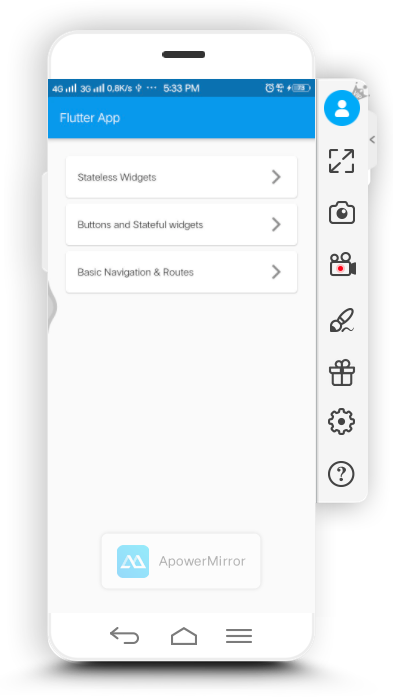
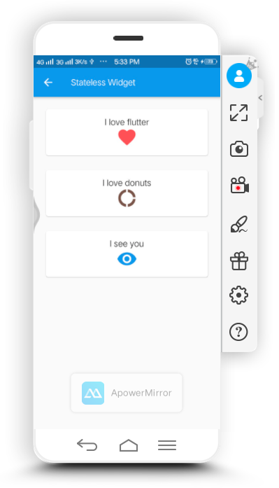
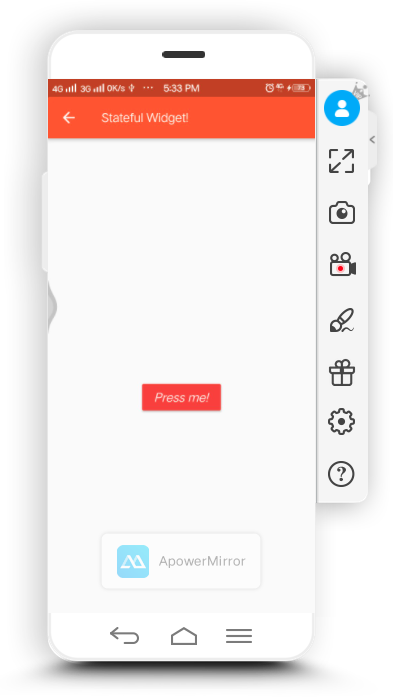
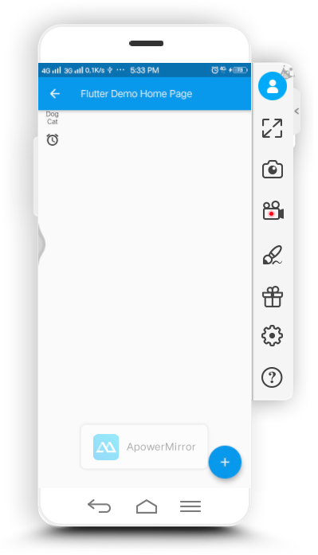

<h1>Laporan hasil pelatihan bootcame mobile app dev minggu kedua hari kedua</h1>
    Hari ini selasa tanggal 11 Februari 2020, seperti biasanya saya mengikuti kegiatan pelatihan di bootcame praxis
    academy. 
    Seperti biasa setiap hari akan ada latihan dan kasus yang harus saya selesaikan sebagai bentuk latihan saya untuk
    menjadi developer mobile app yang baik. 
    Materi kali ini yang kami pelajari adalah Mengenal Widgets dan Layout 
    Apa sajakah yang dipelajari pada materi kali ini?? 
    <ol>
        <li>Pengertian widgets</li>
        <li>Layout widgets untuk aplikasi Flutter</li>
        <li>Lebih lanjut dengan interaktifitas aplikasi Flutter</li>
    </ol>
    Setelah mempelajari materi diatas, barulah mengejakan kasus mengenai :
    <ol>
        <li>Flutter : Stateless Widgets</li>
        <li>Flutter : Buttons and Stateful widgets</li>
        <li>Flutter : Basic Navigation & Routes</li>
    </ol>
    <h3>Tampilan Hasil</h3>
    
    
    
    
    
    <h3>Logic dari aplikasi</h3>
    <h3>Penjelasan mengenai Widgets, Layouts, interaktifitas</h3>
    <h4>Widgets</h4>
    Salah satu istilah yang dibawa oleh Flutter untuk memperkenalkan fitur yang dimilikinya adalah dengan menggunakan istilah Widget. Setiap bagian atau kerangka untuk menyusun UI atau layout dari Flutter akan memanfaatkan widget yang dimilikinya.
    <h4>Layout</h4>
    Layout disini adalah tampilan dari aplikasi yang nantinya akan kita buat. Disini kita juga bisa menampilkan yang Text, Image dan lain lain.
    <h4>interaktifitas</h4>
    Menjelaskan tentang pengelolaan state di Flutter dan pengaruhnya pada widgets sehingga terdapat istilah stateful widgets maupun stateless widgets.