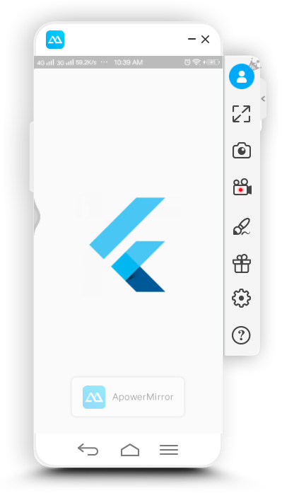
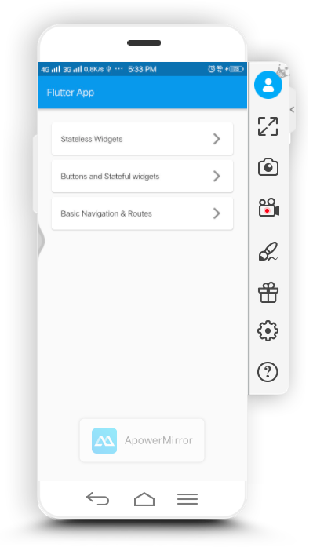
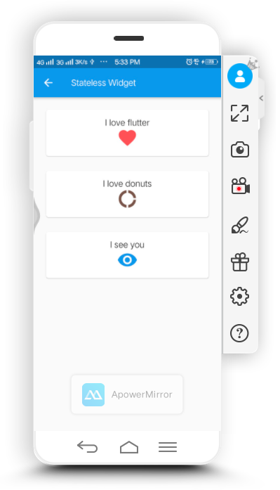
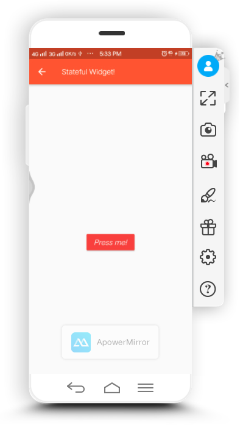
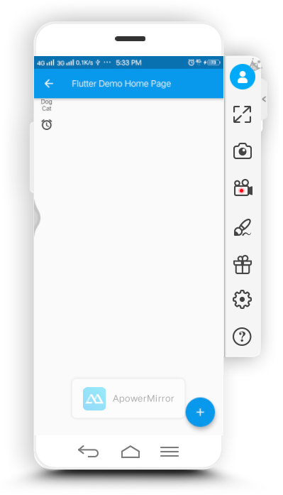

<h1>Laporan hasil pelatihan bootcame mobile app dev minggu kedua hari ketiga</h1>
Hari ini Rabu tanggal 12 Februari 2020, seperti biasanya saya mengikuti kegiatan pelatihan di bootcame praxis
academy. 
Seperti biasa setiap hari akan ada latihan dan kasus yang harus saya selesaikan sebagai bentuk latihan saya untuk
menjadi developer mobile app yang baik. 
Materi kali ini yang kami pelajari adalah mengenai Assets dan Navigasi 
Apa sajakah yang dipelajari pada materi kali ini?? 
<ol>

    <li>Memahami assets, baik berupa images maupun bukan images</li>
    <li>Pengelolaan assets</li>
    <li>Ikon aplikasi</li>
    <li>Launch screen</li>
    <li>Memahami navigasi</li>
    <li>Mengelola routes</li>
</ol>
Setelah mempelajari materi diatas, barulah mengejakan kasus mengenai :
<ol>
    <li>Untuk aplikasi-aplikasi yang sudah dibuat kemarin, silahkan buat launch screen serta ganti ikon dari
        aplikasi tersebut.</li>
    <li>Kerjakan Real World Example pada Navigator class. Perhatikan hasilnya, capture screenshot, setelah itu buat
        dokumentasi README.md dari hasil tersebut.</li>
</ol>
<h3>Tampilan Hasil</h3>
<table>
    <tr>
        <th></th>
        <th></th>
        <th></th>
    </tr>
    <tr>
        <td align="center">launch screen</td>
        <td align="center">home</td>
        <td align="center">Stateless Widgets</td>
    </tr>
    <tr>
        <th></th>
        <th></th>
        <th></th>
    </tr>
    <tr>
        <td align="center">Buttons and   Stateful widgets</td>
        <td align="center">Simple routes   using StatelessWidget</td>
        <td align="center">Routes using   StatefulWidgets</td>
    </tr>

</table>

<h3>Penjelasan</h3>
Dari capture screenshot di atas sudah menjelaskan hasil dari kasus yang dibuat.  
Untuk pembutan launch screen kita bisa membuatnya dengan <strong>class</strong> yang berbeda. Pertama kita buat file
dengan nama <strong>menu.dart</strong> kemudia beri class dengan nama class <strong>Menu</strong>.  
<pre>
    class Menu extends StatefulWidget {
        @override
        _MenuState createState() => _MenuState();
        }
        
        class _MenuState extends State&lt;Menu&gt; {
        @override
        Widget build(BuildContext context) {
            return Container(
            
            );
        }
        }
</pre>
Setelah itu kita buat file baru dengan nama <strong>screen.dart</strong> buat class dengan nama <strong>SplashScreen</strong>. 
<pre>
    class SplashScreen extends StatefulWidget {
        @override
        _SplashScreenState createState() => _SplashScreenState();
    }
    
    class _SplashScreenState extends State&lt;SplashScreen&gt; {
        @override
        Widget build(BuildContext context) {
        return Container(
            
        );
        }
    }
</pre>
Masih di file screen.dart, kemudian tuliskan script dibawah ini:
<pre>
    class _SplashScreenState extends State&lt;SplashScreen&gt; {
        @override
        Widget build(BuildContext context) {
        Future.delayed(Duration(seconds: 3)).then((val) {
            Navigator.pushAndRemoveUntil(context,
                MaterialPageRoute(builder: (context) => Menu()), (e) => false);
        });
    
        return Scaffold(
            body: Container(
            child: Center(
                child: Image.asset(
                "img/1.png",
                width: 200,
                ),
            ),
            ),
        );
        }
    }
</pre>
script dibawah ini 
<pre>
    Future.delayed(Duration(seconds: 3)).then((val) {
        Navigator.pushAndRemoveUntil(context,
            MaterialPageRoute(builder: (context) => Menu()), (e) => false);
    });
</pre>
maksudnya adalah akan ada delay 3 detik untuk menampilkan launch screen kemudian setelah 3 detik kan masuk ke halaman Menu. 
  
<h2>Mengganti Icon Aplikasi</h2>
Untuk mengganti icon aplikasi yang telah kita buat, ada bebrapa cara untuk dilakukan.  
Kita bisa masuk ke file <strong>pubspec.yaml</strong> kemudian tuliskan 
<pre>
    dev_dependencies: 
    flutter_launcher_icons: "^0.7.3"

    flutter_icons:
    android: "launcher_icon" 
    ios: true
    image_path: "assets/icon/icon.png"
</pre>
kemudian run package dengan mengetikkan perintah berikut di terminal
<pre>
    flutter pub get
    flutter pub run flutter_launcher_icons:main
</pre>
tunggu sampai selesai dan tuliskan pada terminal
<pre>
    flutter run
</pre>
untuk menjalankan uplikasi yang telah kita buat.