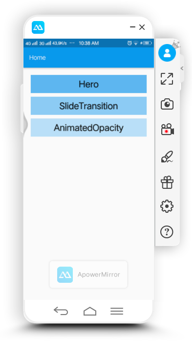
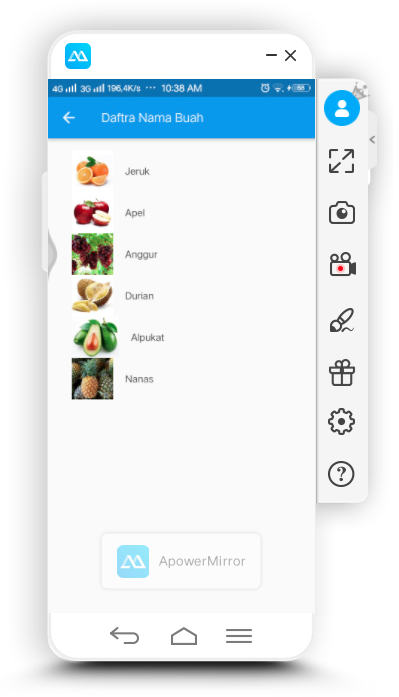
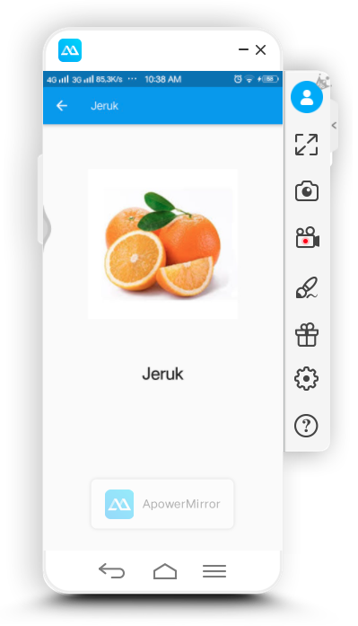
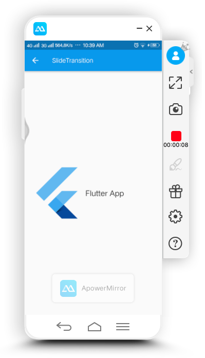
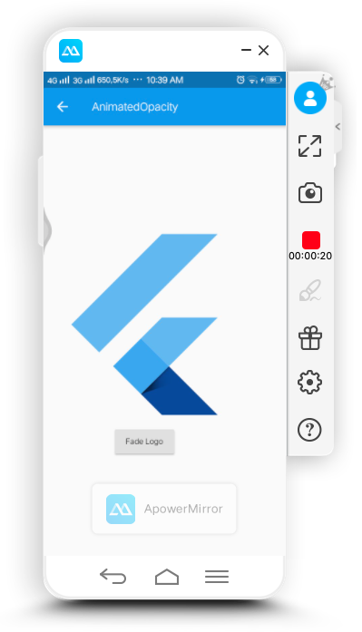

<h1>Laporan hasil pelatihan bootcame mobile app dev minggu kedua hari keempat</h1>
Hari ini Kamis tanggal 13 Februari 2020, seperti biasanya saya mengikuti kegiatan pelatihan di bootcame praxis
academy. 
Seperti biasa setiap hari akan ada latihan dan kasus yang harus saya selesaikan sebagai bentuk latihan saya untuk
menjadi developer mobile app yang baik. 
Materi kali ini yang kami pelajari adalah mengenai Animasi 
Apa sajakah yang dibahas pada materi kali ini?? 
<ol>
    <li>Dasar-dasar animasi di Flutter</li>
    <li>Hero animations</li>
    <li>Staggered animations</li>
    <li>Widget di Flutter untuk animasi dan motion.</li>
</ol>
Dan materi yang dipelajari dan dijelaskan adalah:
<ol>
    <li>Dokumentasi pengenalan animasi menguraikan berbagai sumber daya yang bisa dipelajari untuk animasi di
        Flutter.</li>
    <li>Dokumentasi overview animasi menjelaskan tentang gambaran umum dari fitur animasi yang tersedia di Flutter.
    </li>
    <li>Tutorial memberikan pengetahuan praktik dari fasilitas animasi di Flutter.</li>
    <li>Hero animations</li>
    <li>Staggered animations</li>
    <li>Widget untuk animasi dan motion di Flutter.</li>
</ol>
Setelah mempelajari materi diatas, barulah mengejakan kasus mengenai :
<ol>
    <li>Pelajari widget untuk animasi dan motion, buatlah aplikasi menggunakan minimal 3 dari widget tersebut.
        Gunakan kreatifitas dan imajinasi anda.</li>
</ol>
<h3>Tampilan Hasil</h3>
<table>
    <tr>
        <th></th>
        <th></th>
        <th></th>
    </tr>
    <tr>
        <td align="center">Listview Menu</td>
        <td align="center">Menggunakan   widget hero</td>
        <td align="center">Menggunakan   widget hero</td>
    </tr>
    <tr>
        <th></th>
        <th></th>
    </tr>
    <tr>
        <td align="center">Widget   SlideTransition</td>
        <td align="center">Widget   AnimatedOpacity</td>
    </tr>
</table>

<h3>Penjelasan</h3>
Dari capture screenshot di atas sudah menjelaskan hasil dari kasus yang dibuat.  
Disini saya menggunakna 3 widget, yaitu Hero, SlideTransition dan AnimatedOpacity. 