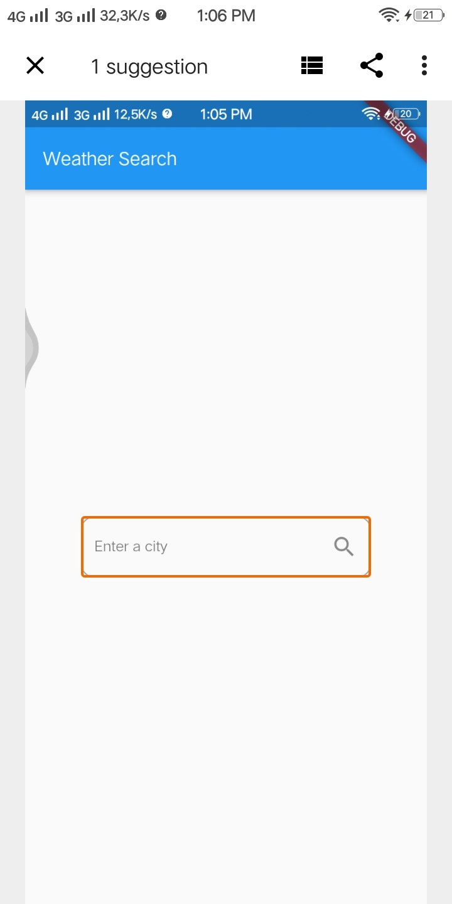
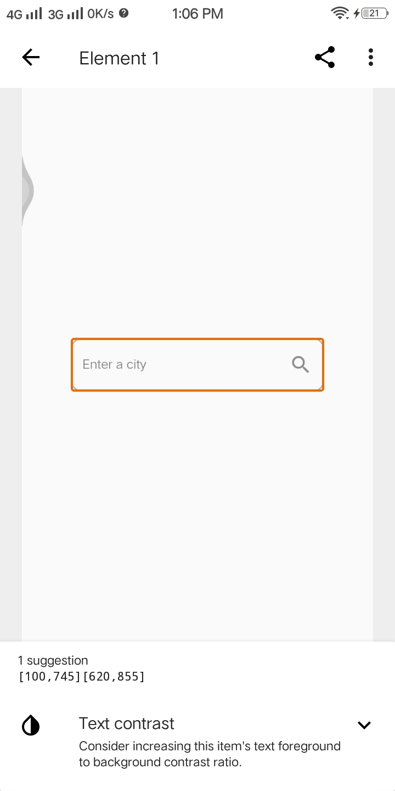
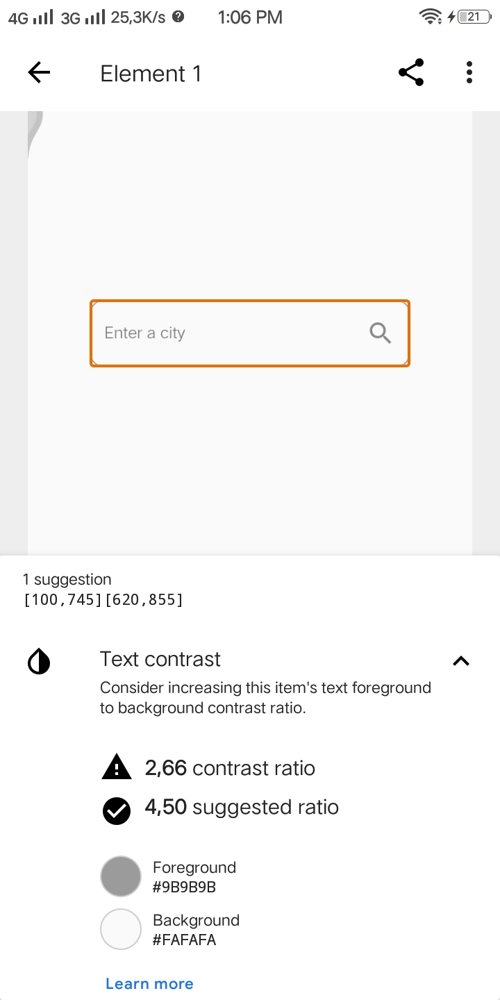
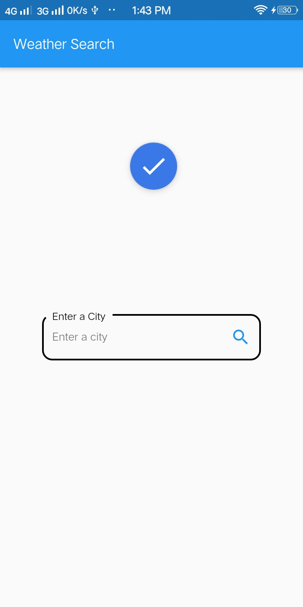
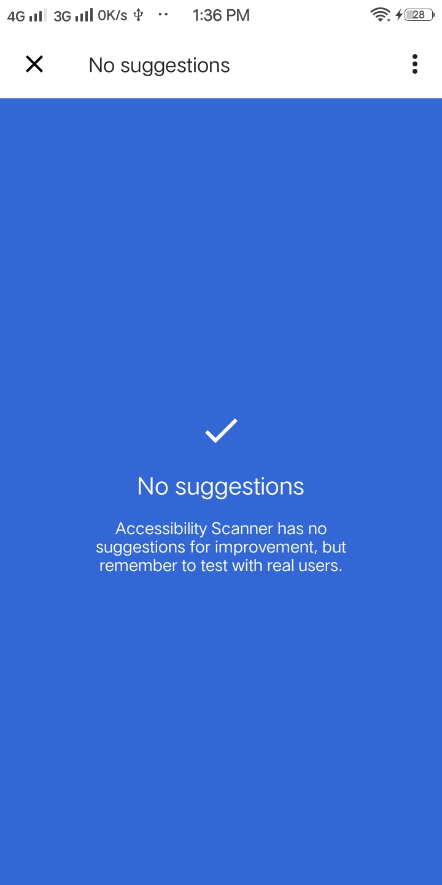
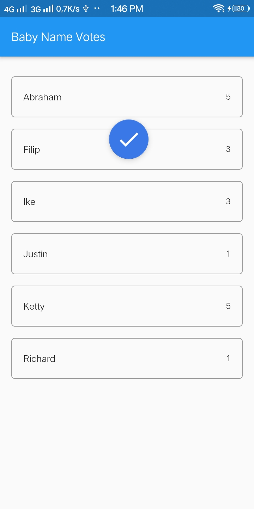
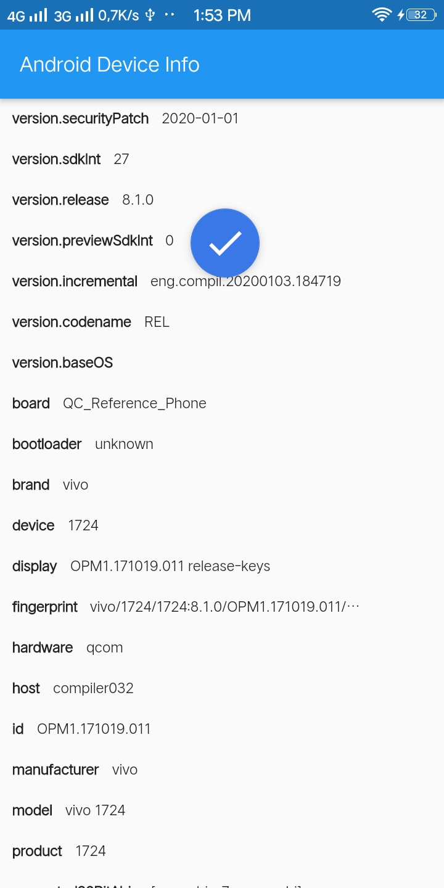

<h1>Aksebilitas</h1>
Kali ini dengan menggunakan minimal 3 aplikasi yang telah saya buat pada hari-hari sebelumnya, saya akan memeriksa
dengan menggunakan Accessibility Scanner dan memperbaiki aplikasi yang telah saya buat sehingga menjadi aplikasi
dengan Aksebilitas yang baik.
<h2>Weather App</h2>
Yang pertama ada aplikasi <a
    href="https://github.com/arari3s/praxis-academy/tree/master/novice/03-01/latihan/stetmeneg">weather app.</a>
   
   
Pada aplikasi ini terdapat saran perbaikan yaitu pada text contrast  

 
kemudian perbaiki pada <a
    href="https://github.com/arari3s/praxis-academy/blob/master/novice/03-01/latihan/stetmeneg/lib/pages/weather_search_page.dart"><kbd>lib/pages/weather_search_page.dart</kbd></a>
 
<pre>
    <code>
    decoration: InputDecoration(
        hintText: "Enter a city",
        labelText: "Enter a City",
        focusedBorder: OutlineInputBorder(
        borderSide: BorderSide(color: Colors.black, width: 2),
        borderRadius: BorderRadius.circular(12),
        ),
        border: OutlineInputBorder(
        borderSide: BorderSide(color: Colors.black, width: 2),
        borderRadius: BorderRadius.circular(12),
        ),
        suffixIcon: Icon(Icons.search),
        labelStyle: TextStyle(
        color: Colors.black,
        fontSize: 20,
        ),
    ),
    </code>
</pre>
kemudian akan tampil seperti berikut :   

  
<h2>Baby Name Votes</h2>
pada aplikasi Baby Name Votes ini no suggestions atau tidak ada yang perlu diperbaiki.   

  
<h2>Android Device Info</h2>
Pada aplikasi ini juga tidak ditemukan yang perlu diperbaiki karena sudah memiliki Aksebilitas yang baik   

