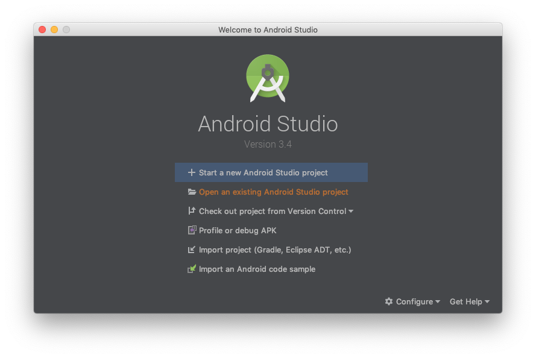
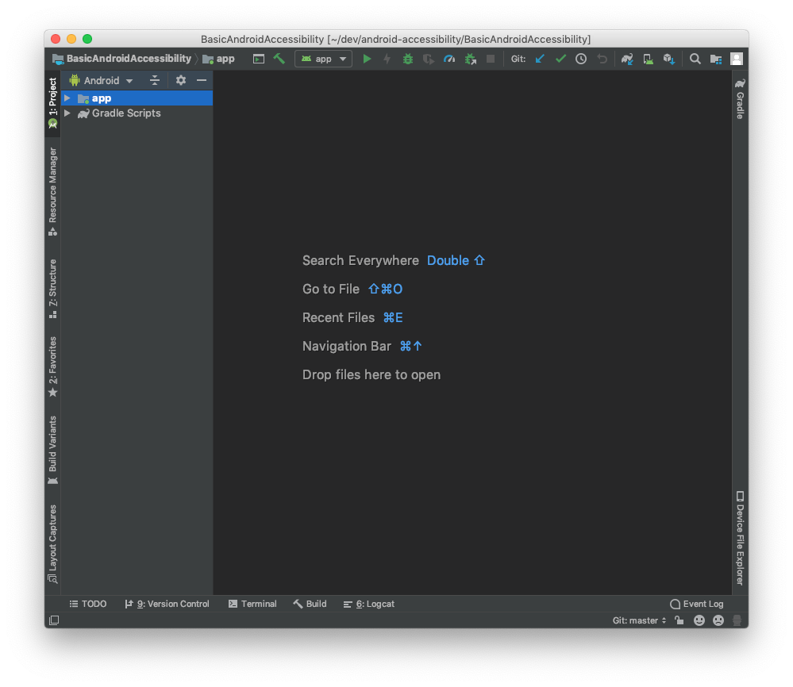
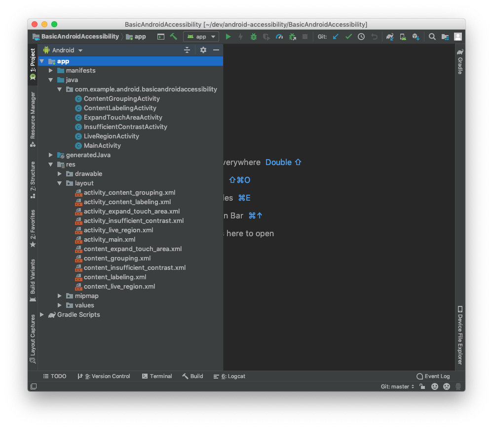
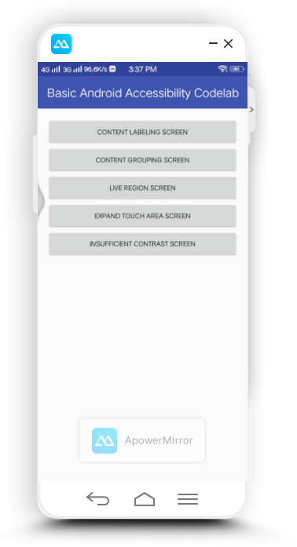
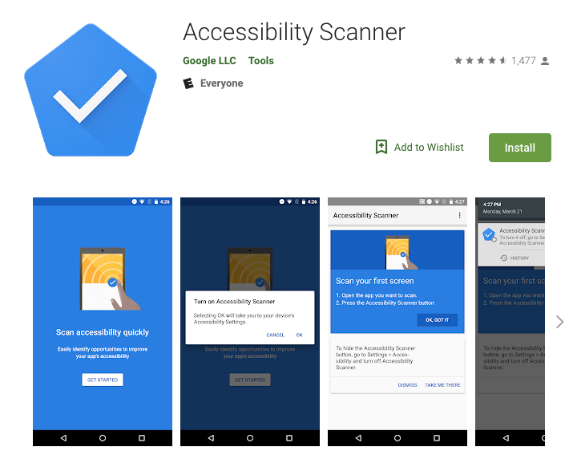
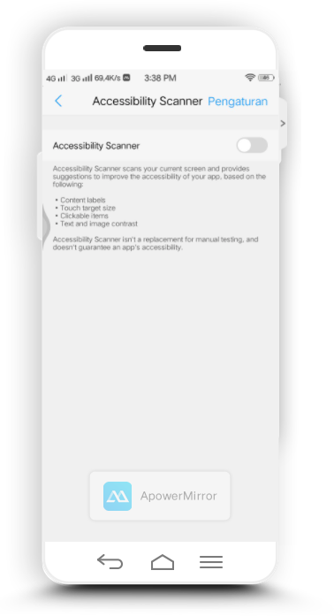
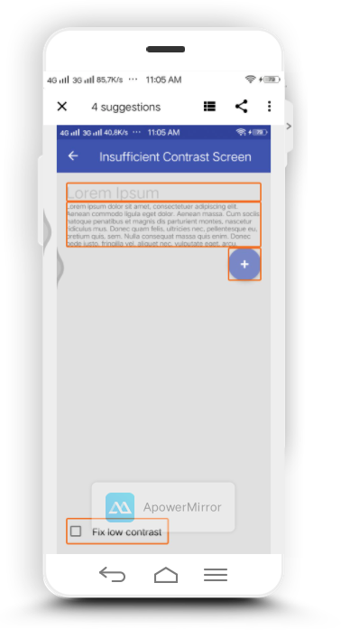
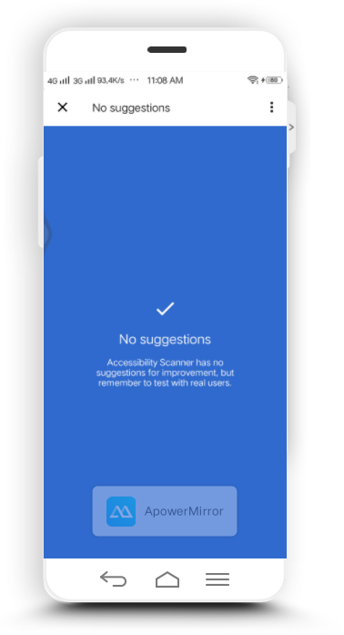

<h1>Aksesibilitas</h1>
<b>Aksesibilitas</b> dalam arti yang dipertimbangkan di sini mengacu pada desain produk, perangkat, layanan, atau
lingkungan sehingga dapat digunakan oleh para penyandang cacat.  
Aksesibilitas dapat dilihat sebagai "kemampuan untuk mengakses" dan mendapat manfaat dari beberapa sistem atau
entitas. Konsep ini berfokus pada memungkinkan akses bagi penyandang cacat, atau kebutuhan khusus, atau memungkinkan
akses melalui penggunaan teknologi bantu. Namun, penelitian dan pengembangan Aksesibilitas membawa manfaat bagi
semua orang.  
Berikut aplikasi-aplikasi untuk test Aksesibilitas.
<h2>Android Basic Accessiblity Service.</h2>
<h2>Basic Android Accessibility: making sure everyone can use what you create!</h2>
Aplikasi Android harus dapat digunakan oleh semua orang, termasuk para penyandang cacat . Cacat umum yang
memengaruhi penggunaan seseorang terhadap perangkat Android termasuk kebutaan atau rabun, tuli atau gangguan
pendengaran, keterampilan motorik terbatas, dan buta warna. Dan ini hanya sebagian daftar.
   
Aplikasi yang ditulis dengan mempertimbangkan aksesibilitas membuat pengalaman pengguna lebih baik untuk semua orang
: pintasan keyboard di Gmail membantu pengguna yang bertenaga, kontras tinggi membantu ketika melihat layar dengan
silau di latar belakang, dan kontrol suara membantu Anda mengontrol perangkat saat memasak.
  
Dengan bekerja melalui codelab ini, Anda akan mendapatkan pengetahuan tentang bagaimana orang-orang dengan cacat
tertentu menggunakan aplikasi Android, dan Anda akan belajar cara menulis aplikasi yang memperkaya pengalaman bagi
para pengguna ini. Jika Anda mengalami masalah apa pun (bug kode, kesalahan tata bahasa, kata-kata yang tidak jelas,
dll.) Saat Anda mengerjakan codelab ini, silakan laporkan masalah tersebut melalui tautan Laporkan kesalahan di
sudut kiri bawah codelab.
<h2>Persiapan</h2>
<h3>Download Kode</h3>
Anda dapat mengkloning repo yang berisi kode utnuk codelab ini:
<pre>
    <code>
        git clone https://github.com/googlecodelabs/basic-android-accessibility.git
    </code>
</pre>
<h3>Menyiapkan Android Studio</h3>
<ul>
    <li>Jalankan Android Studio</li>
    <li>Pilih <b>Open an existing Android Studio project</b></li>
    
    <li>arahkan ke lokasi di mana anda menyimpannya dan pilih<b>basic-android-accessibility-Java</b></li>
    <li>Layar android studio Anda sekarang akan terlihat seperti ini:</li>
    
    <li>Semua file sumber terletak di bawah app / java , dan semua file tata letak muncul di bawah app / res /
        layout.  
        Layar Android Studio dengan direktori yang diperluas akan terlihat seperti ini:
    </li>
    
</ul>
<h3>Run Aplikasi</h3>
Berikut tampilannya setelah di run:  

<h3>Mengaktifkan TalkBack</h3>
<b>TalkBack</b> adalah solusi aksesibilitas paket Android. Ini adalah pembaca layar yang menawarkan umpan balik
pendengaran, haptic, dan lisan, yang memungkinkan pengguna menavigasi dan menggunakan konten pada perangkat mereka
tanpa menggunakan mata mereka. Menggunakan TalkBack adalah cara yang bagus untuk berkenalan dengan cara-cara di mana
seseorang dengan gangguan penglihatan dapat mengakses konten di perangkat mereka, dan itu juga cara yang bagus untuk
menguji aksesibilitas aplikasi Anda sendiri.
<h4>Pengaturan TalkBack</h4>
Ikuti langkah-langkah ini untuk mengatur TalkBack.
<ul>
    <li>Buka <b>Pengaturan</b></li>
    <li>Pilih <b>Aksesibilitas</b></li>
    <li>Nyalakan <b>TalkBack</b> tekan <b>OK</b> dan berikan izin</li>
</ul>
<h3>Pemindaian Aksesibilitas</h3>
Google menawarkan alat Pemindai Aksesibilitas yang menyarankan peningkatan aksesibilitas untuk aplikasi Android —
seperti memperbesar target sentuhan kecil, meningkatkan kontras, dan memberikan deskripsi konten — sehingga individu
dengan kebutuhan aksesibilitas dapat menggunakan aplikasi Anda dengan lebih mudah.
 

 
Setelah diinstal, navigasikan ke Pengaturan> Aksesibilitas. Temukan dan nyalakan Pemindai Aksesibilitas (Ketuk " OK
" dan " Mulai Otorisasi " untuk menyelesaikan alur kerja pengaturan).
 

 
Pemindai Aksesibilitas menyiapkan serangkaian saran untuk peningkatan terkait aksesibilitas: 
  
Klik pada tampilan (disorot melalui batas oranye) untuk melihat saran Pemindai.  
Luangkan waktu untuk melihat apa yang dikatakan pemindai tentang pandangan lain yang telah kita bahas pada langkah
sebelumnya.
 
Sekarang, gunakan tombol Kembali untuk menavigasi kembali ke layar. Gunakan Kotak Centang untuk beralih ke versi
"Perbaiki kontras rendah" layar ini.  
apabila sudah diperbaiki dan sesuai maka tampilan akan seperti berikut :  

  
sumber:  
<a href="https://codelabs.developers.google.com/codelabs/basic-android-accessibility/#0">Aksesibilitas Android
    Dasar</a>
<h2>Developing an Accessibility Service for Android</h2>
