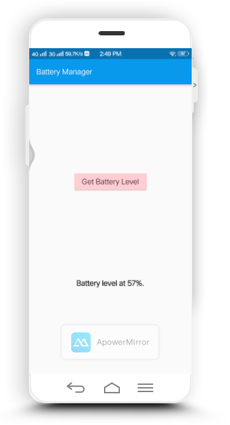

<h1>Platform Specific Code di Android</h1>
Panduan ini menjelaskan cara menulis kode khusus platfrom khusus. Beberapa fungsionalitas platform khusus tersedia
melalaui paket yang ada.   
Flutter menggunakan sistem fleksibel yang memungkinkan anda untuk memanggil API khusus platform apakah tersedia di
kode Java atau Kotlin di Android, atau Objective-C atau kode Swift di iOS.   
Dukungan API khusus platform Flutter tidak bergantung pada perubahan kode, melainkan pada gaya pemberian pesan
fleksibel.
<ul>
    <li>Bagian Flutter dari aplikasi mengirimkan pesan ke <i>hostnya</i>, bagian iOS atau Android dari aplikasi
        memlalui saluran platform</li>
    <li>The Host mendengarkan pada saluran platform, dan menerima pesan. Kemudian panggilan ke sejumlah API khusus
        platform menggunakan bahasa pemrograman asli dan mengirim respons kembali ke <i>klien</i></li>
</ul>
<h2>Contoh Memanggil kode khusus Android menggunakan platform channerls</h2>
<h3>Step 1: Membuat projek baru</h3>
Buat projek baru dengan nama batterylevel
<h3>Step 2: Buka platfrom flutter</h3>
Buka projek batterylevel kemudian ke <kbd>bin/main.dart</kbd>
<pre>
    <code>
        import 'dart:async';
        import 'package:flutter/material.dart';
        import 'package:flutter/services.dart';
        void main() => runApp(MaterialApp(
            debugShowCheckedModeBanner: false,
            home: MyHomePage(),
            ));
        class MyHomePage extends StatefulWidget {
        @override
        _MyHomePageState createState() => _MyHomePageState();
        }
        class _MyHomePageState extends State&lt;MyHomePage&gt; {
        static const platform = const MethodChannel('samples.flutter.dev/battery');
        String _batteryLevel = 'Unknown battery level.';
        Future&lt;void&gt; _getBatteryLevel() async {
            String batteryLevel;
            try {
            final int result = await platform.invokeMethod('getBatteryLevel');
            batteryLevel = 'Battery level at $result%.';
            } on PlatformException catch (e) {
            batteryLevel = "Failed to get battery level: '${e.message}'.";
            }
            setState(() {
            _batteryLevel = batteryLevel;
            });
        }
        @override
        Widget build(BuildContext context) {
            return Scaffold(
            appBar: AppBar(
                title: Text("Battery Manager"),
            ),
            body: Container(
                child: Center(
                child: Column(
                    mainAxisAlignment: MainAxisAlignment.spaceEvenly,
                    children: [
                    RaisedButton(
                        color: Colors.red[100],
                        child: Text(
                        'Get Battery Level',
                        style: TextStyle(fontSize: 20),
                        ),
                        onPressed: _getBatteryLevel,
                    ),
                    Text(
                        _batteryLevel,
                        style: TextStyle(fontSize: 20, fontWeight: FontWeight.bold),
                    ),
                    ],
                ),
                ),
            ),
            );
            }
        }
    </code>
</pre>
<h3>Step 3: Tambahkan implementasi platform Specific ke Android</h3>
Mulai dengan membuka bagian host Android dari Flutter anda di Android Studio:
<ul>
    <li>Buka Android Studio</li>
    <li>pilih file>open..</li>
    <li>arahkan ke direktori flutter anda, pilih folder Android kemudian klik OK</li>
    <li>buka file file <kbd>MainActivity.kt</kbd> yant terletak difolder kotlin</li>
</ul>
di file <kbd>MainActivity.kt</kbd> tuliskan skrip berikut
<pre>
    <code>
        import androidx.annotation.NonNull
        import io.flutter.embedding.android.FlutterActivity
        import io.flutter.embedding.engine.FlutterEngine
        import io.flutter.plugin.common.MethodChannel
        import io.flutter.plugins.GeneratedPluginRegistrant
        class MainActivity: FlutterActivity() {
            private val CHANNEL = "samples.flutter.dev/battery"
        override fun configureFlutterEngine(@NonNull flutterEngine: FlutterEngine) {
            GeneratedPluginRegistrant.registerWith(flutterEngine)
            MethodChannel(flutterEngine.dartExecutor.binaryMessenger, CHANNEL).setMethodCallHandler {
                call, result ->
                }
            }
        }
    </code>
</pre>
kemudian tambahkaan skrip berikut di bagian atas
<pre>
    <code>
        import android.content.Context
        import android.content.ContextWrapper
        import android.content.Intent
        import android.content.IntentFilter
        import android.os.BatteryManager
        import android.os.Build.VERSION
        import android.os.Build.VERSION_CODES
    </code>
</pre>
selanjutnya, letakkan skrip berikut di bawah <kbd> configureFlutterEngine() method:</kbd>
<pre>
    <code>
        private fun getBatteryLevel(): Int {
            val batteryLevel: Int
            if (VERSION.SDK_INT >= VERSION_CODES.LOLLIPOP) {
                val batteryManager = getSystemService(Context.BATTERY_SERVICE) as BatteryManager
                batteryLevel = batteryManager.getIntProperty(BatteryManager.BATTERY_PROPERTY_CAPACITY)
            } else {
                val intent = ContextWrapper(applicationContext).registerReceiver(null, IntentFilter(Intent.ACTION_BATTERY_CHANGED))
                batteryLevel = intent!!.getIntExtra(BatteryManager.EXTRA_LEVEL, -1) * 100 / intent.getIntExtra(BatteryManager.EXTRA_SCALE, -1)
            }
            return batteryLevel
            }
    </code>
</pre>
terakhir, hapus skrip berikut:
<pre>
    <code>
        MethodChannel(flutterEngine.dartExecutor.binaryMessenger, CHANNEL).setMethodCallHandler {
            call, result ->
            }
    </code>
</pre>
dan ganti dengan skrip dibawah ini
<pre>
    <code>
        MethodChannel(flutterEngine.dartExecutor.binaryMessenger, CHANNEL).setMethodCallHandler {
            call, result ->
            if (call.method == "getBatteryLevel") {
                val batteryLevel = getBatteryLevel()
                if (batteryLevel != -1) {
                result.success(batteryLevel)
                } else {
                result.error("UNAVAILABLE", "Battery level not available.", null)
                }
            } else {
                result.notImplemented()
            }
            }
    </code>
</pre>
save dan run flutter anda dan akan tampil seperti berikut.  

