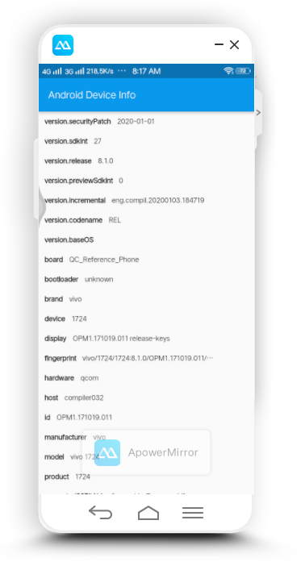

<h1>Paket dan Plugin | Menampilkan informasi sistem Android</h1>
<h2>Cara penggunaan packages</h2>
Ekosistem Dart menggunakan packages untuk mengelola perangkat lunak bersama seperti perpustakaan dan alat. Untuk
mendapatkan packages dart, anda bisa menggunakan <b>pub package manager</b>. Anda dapat menemukan packages yang
tersedia untuk umum di <a href="https://pub.dev/">situs pub.dev</a> atau anda dapat memuat packages dari sistem file
lokal atau ditempat lain, seperti repositori Git. Dari mana pun packages Anda berasal, pub mengelola dependensi
versi, membantu anda mendapatkan bersi paket yang saling bekerja sama dan dengan versi SDK anda.   
Untuk menggunakan package, lakukan hal berikut:
<ul>
    <li>Buat pubspec(file bernama pubspec.yaml yang mencantumkan dependensi package dan menyertakan metadata
        lainnya, seperti nomor versi)</li>
    <li>Gunakan pub untuk mendapatkan dependensi package anda</li>
    <li>Jika kode Dart anda tergantung pada perpustakaan dalam package, import ke perpustakaan</li>
</ul>
<h2>Membuat Pubspec</h2>
Pubspec adalah file bernama pubspec.yaml yang ada di direktori teratas aplikasi anda. Pubspec yang mungkin paling
sederhana hanya mencantumkan nama package:
<pre>
<code>
    name: my_app
</code>
</pre>
Berikut adalah contoh dari pubspec yang menyatakan dependensi pada dua paket(js dan intl) yang dihost di situs
pub.dev:
<pre>
<code>
    name: my_app
    dependdencies:
        js: ^0.6.0
        intl: ^0.15.8
</code>
</pre>
Untuk detail tentang cara membuat pubspec, lihat <a href="https://dart.dev/tools/pub/pubspec">pubspec
    documentation</a> dan dokumentasi untuk paket yang ingin anda gunakan.
<h2>Getting packages</h2>
Setelah anda memiliki pubspec, anda dapat menjalankan pub get dari direktori teratas aplikasi anda:
<pre>
<code>
    $ cd &lt;path-to-my_app&gt;
    $ pub get
</code>
</pre>
Proses ini disebut mendapatkan dependensi.
<h2>Mengimpor libraries dari packages</h2>
Untuk mengimpor libraries yang ditemukan dalam package, gunakan package awalah:
<pre>
<code>
    import 'package:js/js.dart' as js;
    import 'package:intl/intl.dart';
</code>
</pre>
Dart runtime mengambil semuanya setelahnya package: dan mencarinya di dalam .packagesfile untuk aplikasi Anda.
  
<h2>Menampilkan informasi sistem Android</h2>
Untuk menggunakan package ini:
<ol>
    <li>Buat proyek baru <kbd>appinfo</kbd></li>
    <li>Buka <kbd>lib/main.dart</kbd> dan ganti kontek lengkapnya dengan:</li>
    <pre>
    <code>
        import 'dart:async';
        import 'dart:io';
        import 'package:flutter/material.dart';
        import 'package:device_info/device_info.dart';
        import 'package:flutter/services.dart';
        void main() => runApp(MaterialApp(
                debugShowCheckedModeBanner: false,
                home: MyApp(),
            ));
        class MyApp extends StatefulWidget {
            @override
            _MyAppState createState() => _MyAppState();
        }
        class _MyAppState extends State&lt;MyApp&gt; {
            static final DeviceInfoPlugin deviceInfoPlugin = DeviceInfoPlugin();
            Map&lt;String, dynamic&gt; _deviceData = &lt;String, dynamic&gt;{};
            @override
            void initState() {
            super.initState();
            initPlatformState();
            }
            Future&lt;void&gt; initPlatformState() async {
            Map&lt;String, dynamic&gt; deviceData;
            try {
                if (Platform.isAndroid) {
                deviceData = _readAndroidBuildData(await deviceInfoPlugin.androidInfo);
                }
            } on PlatformException {
                deviceData = &lt;String, dynamic&gt;{
                'Error:': 'Failed to get platform version.'
                };
            }
            if (!mounted) return;
            setState(() {
                _deviceData = deviceData;
            });
            }
            Map&lt;String, dynamic&gt; _readAndroidBuildData(AndroidDeviceInfo build) {
            return &lt;String, dynamic&gt;{
                'version.securityPatch': build.version.securityPatch,
                'version.sdkInt': build.version.sdkInt,
                'version.release': build.version.release,
                'version.previewSdkInt': build.version.previewSdkInt,
                'version.incremental': build.version.incremental,
                'version.codename': build.version.codename,
                'version.baseOS': build.version.baseOS,
                'board': build.board,
                'bootloader': build.bootloader,
                'brand': build.brand,
                'device': build.device,
                'display': build.display,
                'fingerprint': build.fingerprint,
                'hardware': build.hardware,
                'host': build.host,
                'id': build.id,
                'manufacturer': build.manufacturer,
                'model': build.model,
                'product': build.product,
                'supported32BitAbis': build.supported32BitAbis,
                'supported64BitAbis': build.supported64BitAbis,
                'supportedAbis': build.supportedAbis,
                'tags': build.tags,
                'type': build.type,
                'isPhysicalDevice': build.isPhysicalDevice,
                'androidId': build.androidId,
            };
            }
            @override
            Widget build(BuildContext context) {
            return Scaffold(
                appBar: AppBar(
                title: Text("Android Device Info"),
                ),
                body: ListView(
                shrinkWrap: true,
                children: _deviceData.keys.map((String property) {
                    return Row(
                    children: &lt;Widget&gt;[
                        Container(
                        padding: EdgeInsets.all(10.0),
                        child: Text(
                            property,
                            style: TextStyle(fontWeight: FontWeight.bold),
                        ),
                        ),
                        Expanded(
                            child: Container(
                        padding: EdgeInsets.fromLTRB(0.0, 10.0, 0.0, 10.0),
                        child: Text(
                            '${_deviceData[property]}',
                            overflow: TextOverflow.ellipsis,
                        ),
                        ))
                    ],
                    );
                }).toList(),
                ),
            );
            }
        }                        
    </code>
</pre>
    <li>Jalankan aplikasi, sekarang akan tampil informasi sistem android kalian</li>
</ol>

 
Sumber
 
<a href="https://stackoverflow.com/questions/45300661/how-to-check-the-device-os-version-from-flutter">stackoverflow</a>
 
<a href="https://github.com/flutter/plugins/blob/master/packages/device_info/example/lib/main.dart">Github</a>
